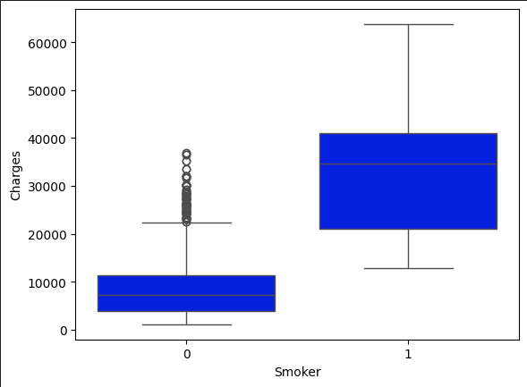

# Insurance Cost Analysis

## Introduction

This project focuses on analyzing and predicting insurance costs based on various factors such as age, sex, BMI, number of children, smoking status, and region. The goal is to apply multiple regression models to predict insurance charges and evaluate their performance.

## Technologies Used
- **Programming Language**: Python
- **Libraries**: Pandas, NumPy, Scikit-Learn, Matplotlib, Seaborn
- **Tools**: Jupyter Notebook

## Dataset

The dataset contains 2771 entries with the following columns:

| Parameter |Description| Content type |
|---|----|---|
|age| Age in years| integer |
|gender| Male or Female|integer (1 or 2)|
| bmi | Body mass index | float |
|no_of_children| Number of children | integer|
|smoker| Whether smoker or not | integer (0 or 1)|
|region| Which US region - NW, NE, SW, SE | integer (1,2,3 or 4 respectively)| 
|charges| Annual Insurance charges in USD | float|

## Data Analysis and Visualization

Data visualization techniques such as box plots and distribution plots were used to understand the relationships between variables and insurance charges.

<div align="center">
  
  The regression plot for `charges` with respect to `bmi`.
  
  
 The box plot for `charges` with respect to `smoker`.
  
</div>


## Models and Evaluation

### Linear Regression

Linear Regression was applied to predict insurance charges. The R^2 score obtained for this model was: `0.7504083820289634`.

### Ridge Regression

Ridge Regression, a regularized version of Linear Regression, was also applied. The R^2 score obtained for this model was: `0.7115696971487694`.

### Polynomial Regression

Polynomial Regression was explored to capture non-linear relationships. The R^2 score obtained for this model was: `0.8133405851901191`.

## Conclusion

The analysis provided insights into the factors affecting insurance costs and demonstrated the effectiveness of different regression models in predicting these costs. Future work could include exploring additional features and advanced modeling techniques.

## Acknowledgements

This project was developed as part of a machine learning study to apply regression techniques to real-world datasets.

## Getting Started
To get started with this project, clone the repository and install the necessary dependencies:
```bash
git clone https://github.com/burhanahmed1/LaptopPricing-MachineLearning-Analysis.git
cd LaptopPricing-MachineLearning-Analysis
pip install -r requirements.txt
```

## Usage
Open the Jupyter notebook:
```bash
jupyter notebook LaptopPricing-ML.ipynb
```

## Contributing
Contributions are welcome! Please fork this repository and submit pull requests.

## License
This project is licensed under the MIT License.
